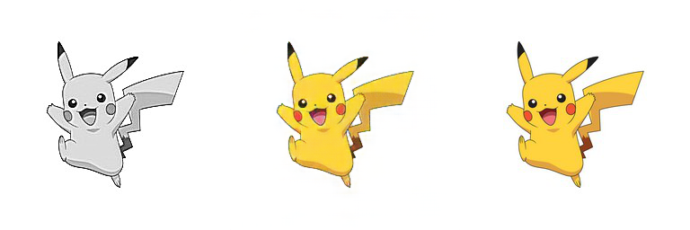
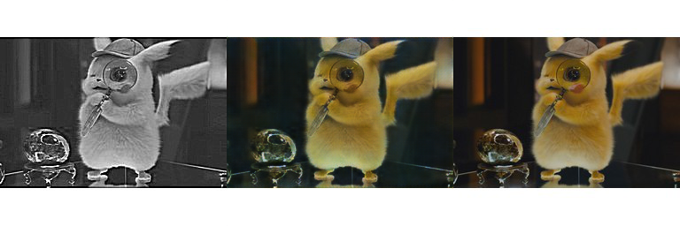
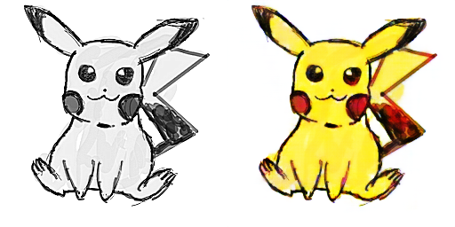
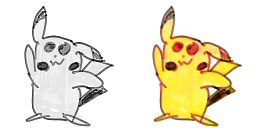
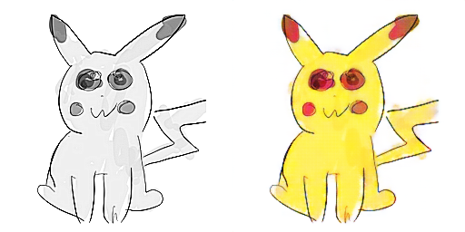

# pix2pix로 피카츄 색칠하기
YBIGTA 15기 신입기수 컨퍼런스

## train data

순서대로 input, predict, ground truth

## test data

실제로 그린 피카츄를 학습시킨 모델로 색칠한 결과

## Thanks to
- YBIGTA 15기 김정학
- YBIGTA 15기 송하룡
- YBIGTA 15기 조준흠
- YBIGTA 15기 최종문

## 참고자료
<https://github.com/taeoh-kim/Pytorch_Pix2Pix>
